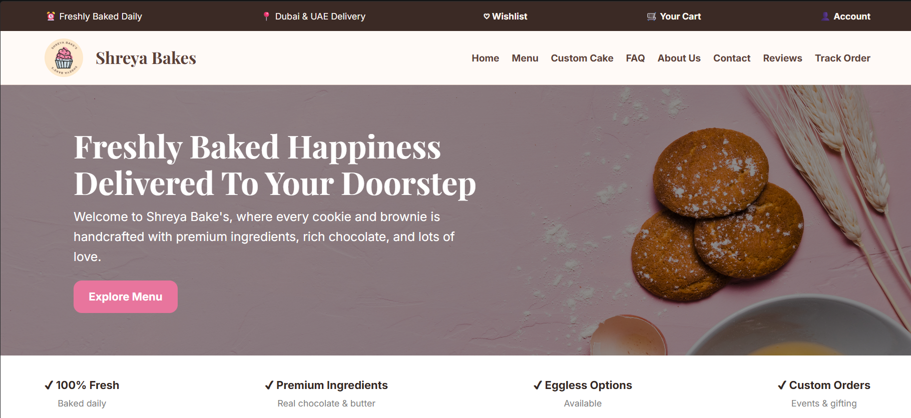
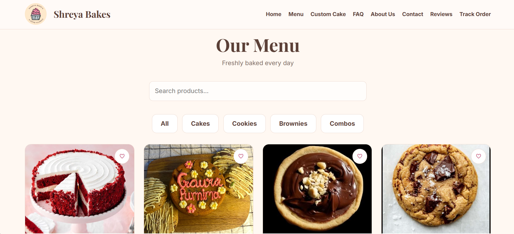
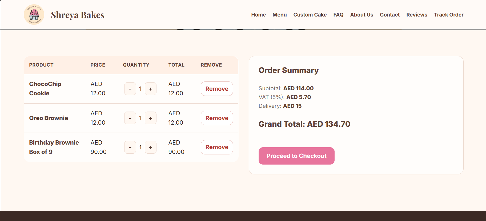
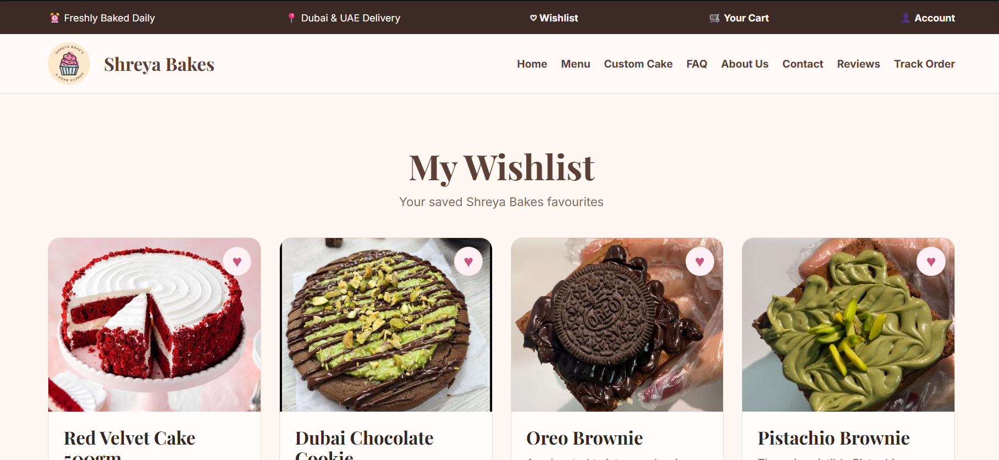
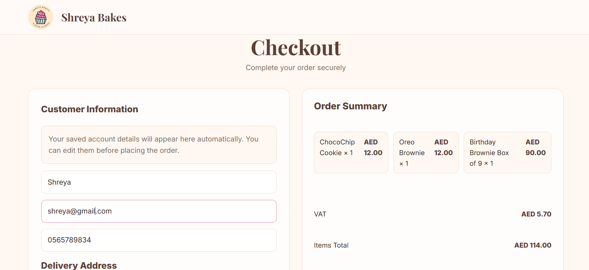
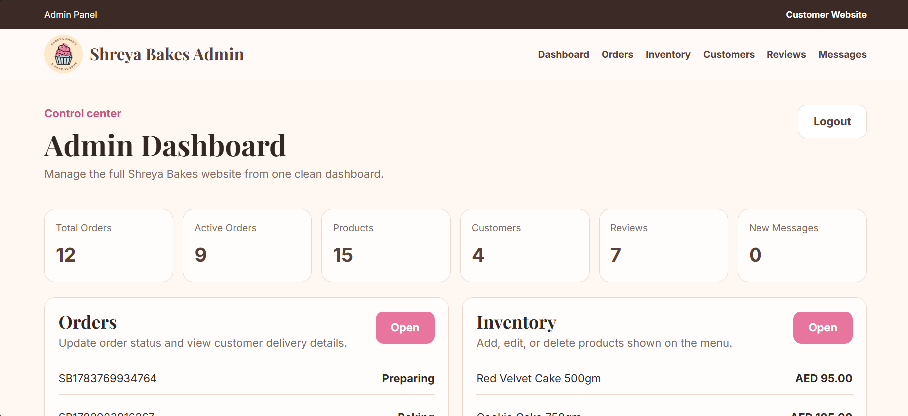
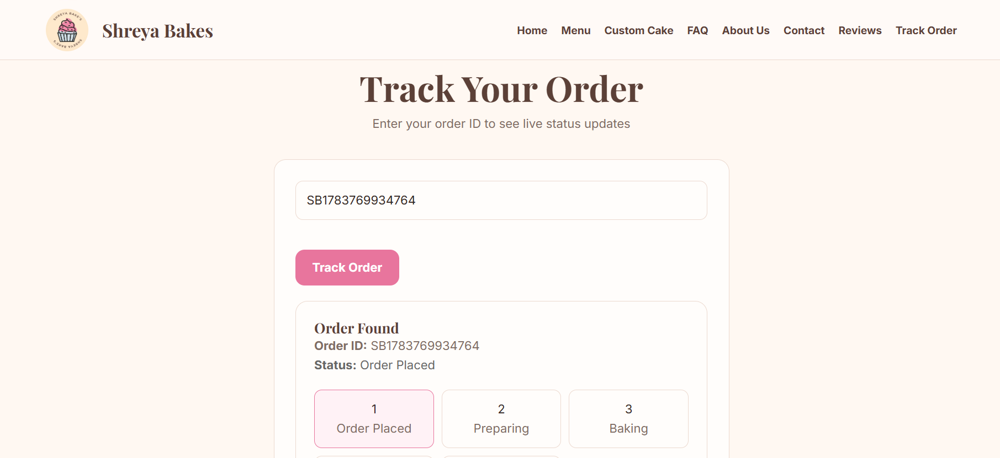

# 🍰 Shreya Bakes

A full-stack bakery ordering web application where customers can explore delicious treats, build their cart, place orders, and track their sweet deliveries.

Built by a team of four university students who wanted to create something more interesting than another basic "Hello World" project. The result? A digital bakery where the only thing missing is the smell of freshly baked cake.

---

## 📌 Project Overview

Shreya Bakes is a web-based bakery management and ordering system designed to provide customers with a simple online shopping experience while allowing administrators to manage products, customers, reviews, and orders.

The application includes customer-facing features such as menu browsing, cart management, wishlist functionality, checkout, and order tracking, along with an administrative dashboard for managing bakery operations.

---

## ✨ Features

### 👥 Customer Features

- Browse bakery products through an interactive menu
- View product details and categories
- Add items to cart
- Manage wishlist items
- Update cart quantities and calculate order totals
- Complete checkout process
- Track order status
- Create and manage customer accounts
- Submit reviews and feedback
- View frequently asked questions

### 🔐 Admin Features

- Admin dashboard interface
- Manage products and menu items
- View customer information
- Manage customer reviews
- Monitor customer orders

---

## 🛠️ Technologies Used

### Frontend

- HTML5
- CSS3
- JavaScript

### Backend

- Node.js
- Express.js

### Data Storage

- JSON files

### Development Tools

- Git & GitHub
- Visual Studio Code

---

## 📂 Project Structure

```
Shreya-Bakes/
│
├── data/
│   ├── products.json
│   ├── users.json
│   ├── orders.json
│   └── other data files
│
├── public/
│   ├── css/
│   │   └── style.css
│   │
│   ├── js/
│   │   └── JavaScript files
│   │
│   ├── images/
│   │   └── Website assets
│   │
│   └── HTML pages
│
├── screenshots/
│   └── Website screenshots
├── server.js
├── package.json
├── package-lock.json
├── LICENSE
└── README.md
```

---

## 🚀 Running the Project

### 1. Clone the repository

```bash
git clone https://github.com/HatimMB/shreya-bakes-website.git
```

### 2. Navigate into the project folder

```bash
cd shreya-bakes-website
```

### 3. Install dependencies

```bash
npm install
```

### 4. Start the server

```bash
npm start
```

### 5. Open the website

Visit:

```
http://localhost:3000
```

---

## 🖥️ Screenshots

### Home Page



### Menu



### Cart



### Wishlist



### Checkout



### Admin Dashboard



### Order Tracking



---

## 👨‍💻 Team

Developed collaboratively by a team of four students.

All team members contributed equally to the design, development, testing, and improvement of the application.

---

## 🔮 Future Improvements

Although Shreya Bakes is fully functional as a local web application, there are several improvements that could take it further:

- Replace JSON storage with a database such as MySQL or MongoDB
- Add secure user authentication
- Implement online payment integration
- Deploy the application online
- Add additional accessibility improvements

---

## 📜 License

This project is licensed under the MIT License.

---

## ☕ Final Note

This project started with a simple idea: "What if we built a bakery website?"

A few pages, many lines of code, and probably too much coffee later, Shreya Bakes became a complete ordering system.

Thanks for checking it out! 🍰